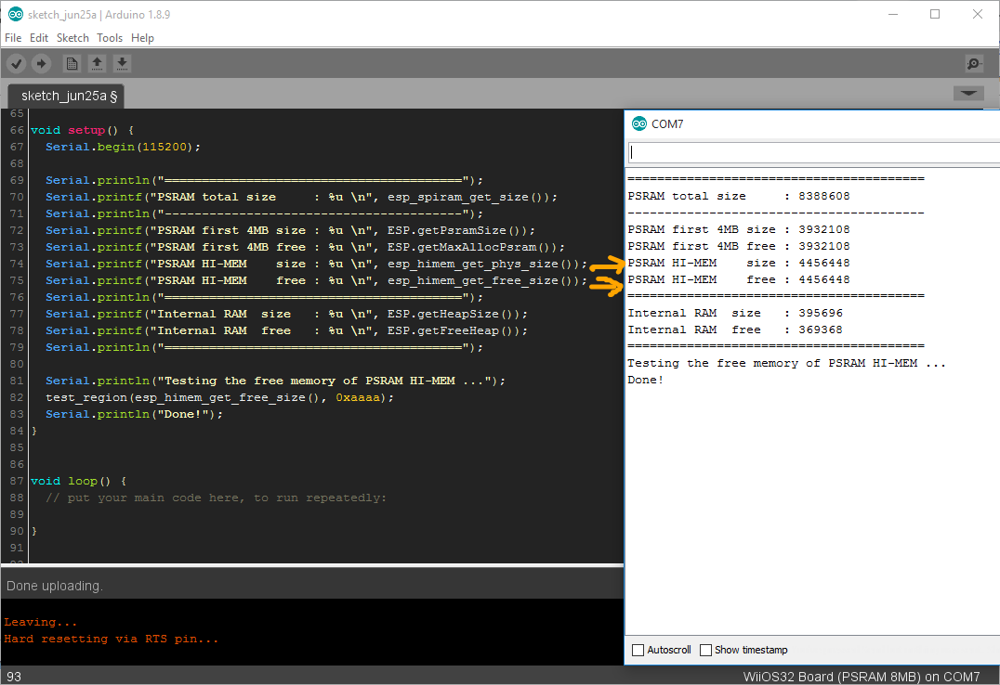

# arduino_esp32_himem

ESP32 รุ่นที่สนับสนุน RAM ภายนอก (SRAM/ PSRAM/ SPI RAM)  
สำหรับ ArduinoIDE ปกติจะสามารถเข้าถึง ได้เพียง 4MB แรกเท่านั้น  
แม้ตัว RAM ภายนอกได้ต่อไว้ถึง 8MB ก็ตาม  

การเข้าถึงคำสั่ง 4MB ส่วนบน (ESP32 HIMEM) สำหรับบน Arduino จะยังไม่สามารถเข้าถึงได้  

เช่น
คำสั่ง esp_himem_get_phys_size();  
--> คำสั่งสำหรับแสดงขนาด พื้นที่ PSRAM ส่วน HIMEM ที่เกินจาก 4MB แรก  

คำสั่ง esp_himem_get_free_size();  
--> คำสั่งสำหรับแสดงขนาดพื้นที่ส่วน PSRAM ส่วน HIMEM ที่จะสามารถจองพื้นที่ได้  

ฯลฯ 

เพื่อการนำ RAM ภายนอกมาใช้งานได้มากขึ้น  
source code ใน repository นี้  
จะเป็นตัวเสริมที่ทำให้ Arduino-ESP32 สามารถเข้าถึงคำสั่งจัดการ 4MB ส่วนบน ของ PSRAM ได้ด้วย  

__Usage__

1. Copy files in folder  /core   to your Arduino platform folder at
```
C:\Users\ &lt;USER NAME&gt; \AppData\Local\Arduino15\packages\esp32\hardware\esp32\1.0.2\cores
```

2. Test Arduino Sketch by /example/ESP32_PSRAM_Himem/ESP32_PSRAM_Himem.ino  

<p align="center">
  
</p>  

TridentTD  
25 June 2018  
